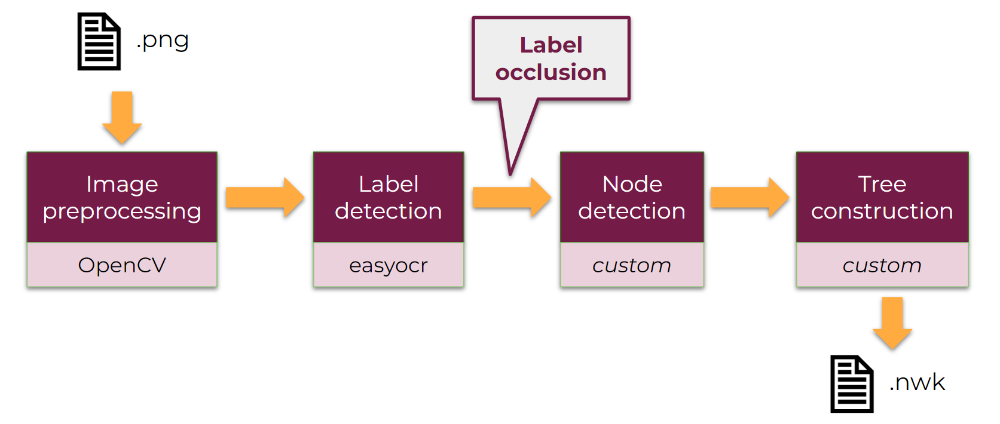

# Png Tree Converter

## Members
Aleksandra Cupriak, Agnieszka Kowalewska, Joanna Krawczyk

## Contents
  * [Project description](#project-description)
  * [Main tasks](#main-tasks)
  * [Extra tasks](#extra-tasks)
  * [Update](#update)
  * [Pipeline description](#pipeline-description)
  * [Requirements](#requirements)
  * [Installation and launch](#installation-and-launch)

## Project description
This is a final project for the Architecture of Large Projects in Bioinformatics course. 
The goal of the project is motivated by the struggle to analyse, convert and download phylogenetic trees 
found in scientific articles. 

We propose Png Tree Converter - an online tool converting phylogenetic trees in image format (.png) to newick format. 
Our approach is based on custom image processing algorithms.

### Main tasks:
1. Extract dendrogram structure from .png image for binary, 
rooted trees oriented vertically (having leaves at the bottom of the image).
2. Extract leaf names.
3. Write dendrogram data to a newick file.

### Extra tasks:
* Create an online tool using ```Streamlit```,
* adjust the algorithm for different tree orientations,
* create online tree visualisations (toytree, biopython etc.).

### Update
We fulfilled all main tasks. The first task was also extended for trees
oriented horizontally.
We also succeeded in developing a Streamlit application working locally. 
However, we cannot deploy our application on Streamlit 
Community Cloud as proposed in extra tasks, since we use ```OpenCV```
library which works on local computer, 
but will fail as soon as we launch it on Streamlit Community Cloud
[(explanation)](https://discuss.streamlit.io/t/problem-error-import-cv2/26348/7).

### Pipeline description


### Requirements

  * [Miniconda](https://docs.conda.io/en/latest/miniconda.html)

### Installation and launch
All the environment requirements are gathered in ```environment.yml``` file. You can easily install a conda environment with all the necessary dependencies by running the command:

    conda env create -f environment.yml

To run Streamlit locally on your computer, you need to:
1. Activate ```ptc``` conda environment
2. Open the ```browser/``` folder in your terminal.
3. Paste ```streamlit run main_page.py```.
4. Access the application via the localhost link printed in your terminal.
